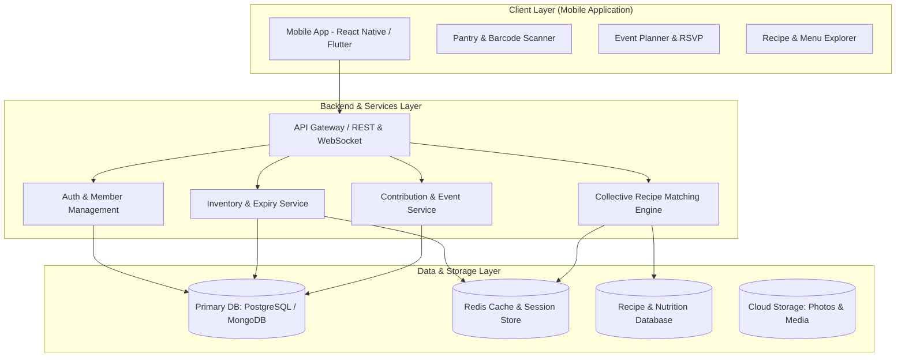
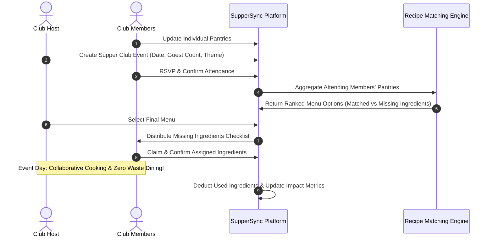

# 🍽️ SupperSync

<p align="center">
  <strong>Transforming Community Dining through Shared Food Inventories, Collaborative Meal Planning, and Zero-Waste Cooking</strong>
</p>

<p align="center">
  
  
  
  
</p>

---

## 📌 Executive Summary

Traditional culinary applications focus strictly on individual users and their isolated kitchens, often leading to fragmented meal planning, excessive grocery spend, and food waste. **SupperSync** re-envisions meal preparation as a shared, cooperative endeavor.

Built for community supper clubs, co-housing networks, shared student flats, and foodie circles, **SupperSync** merges individual household pantries into a dynamic, **collective virtual pantry**. When club members organize a gathering, SupperSync cross-references their combined resources to suggest feasible, appetizing menus, flags missing ingredients, and orchestrates equitable ingredient contribution checklists—fostering community connection and reducing food waste.

---

## 💡 The Problem & The Solution

```
Traditional Dining Dilemma:
  [Host A overbuys] + [Guest B brings duplicates] + [Unused perishables spoil] ➔ High Costs & Food Waste

The SupperSync Approach:
  [Shared Virtual Pantry] ➔ [Intelligent Recipe Matching] ➔ [Equitable Assignment] ➔ Collaborative Zero-Waste Dining
```

| Challenge | Traditional Approach | SupperSync Solution |
| :--- | :--- | :--- |
| **Pantry Visibility** | Isolated to single households; no insight into friends' ingredients. | **Federated Virtual Inventory**: Aggregates opted-in items across club members. |
| **Menu Planning** | Guesswork, uncoordinated potlucks, or overwhelming grocery runs. | **Collective Recipe Engine**: Recommends dishes curated from collective ingredients. |
| **Missing Ingredients** | Host purchases everything or items are duplicated. | **Gap Analysis & Contribution Split**: Pinpoints missing staples and auto-assigns items. |
| **Food Waste** | Perishables sit unused past expiration dates. | **Waste Prevention Priority**: Prioritizes near-expiry items across all member inventories. |
| **Event Logistics** | Cluttered group chats, forgotten commitments, uneven costs. | **Centralized Event Portal**: Real-time RSVP, task tracking, and host rotation. |

---

## ✨ Core Features

### 🥫 1. Collective Virtual Inventory
- **Personal & Club Pantries**: Members manage their private kitchen inventory and decide which items to publish to their club's shared pool.
- **Smart Expiration Tracker**: Tracks shelf life and flags items nearing expiration for early utilization.
- **Barcode & Quick Add**: Streamlined ingredient logging with quantity, units, storage type (pantry/fridge/freezer), and dietary tags.

### 🍳 2. Collective Recipe & Menu Recommendation Engine
- **Ingredient-Driven Suggestion**: Queries recipe databases against aggregated club inventories to discover what can be cooked immediately.
- **Missing Ingredient Gap Analysis**: Highlights exactly what ingredients are missing and ranks dishes by "pantry match percentage".
- **Dietary Consensus Filtering**: Automatically aligns recipe recommendations with all attending members' dietary requirements (e.g., vegan, gluten-free, nut allergies).

### 🤝 3. Smart Contribution & Potluck Coordinator
- **Automated Ingredient Assignment**: Fairly distributes missing ingredient responsibilities or preparation tasks among attendees.
- **"Who Brings What" Checklist**: Interactive live checklist with confirmation statuses, push notifications, and reminders.
- **Fair-Share Metric**: Tracks member contributions over time to ensure balanced responsibilities across the supper club.

### 📅 4. Supper Club Event Management
- **Event Scheduling & Host Rotation**: Schedule dinners, brunches, and potlucks with recurring schedules or host rotation.
- **RSVP & Headcount Forecasting**: Dynamic menu portion adjustments based on confirmed attendee counts.
- **Live Event Dashboard**: Real-time status of dishes, prep checklists, and beverage pairings on the day of the event.

### 🌿 5. Sustainability & Impact Analytics
- **Food Waste Saved**: Calculates the volume and estimated dollar value of ingredients rescued from expiration.
- **Carbon Footprint Offset**: Estimates greenhouse gas emissions prevented through collaborative consumption.
- **Club Leaderboards & Badges**: Gamified milestones celebrating active sharing, zero-waste dinners, and creative cooking.

---

## 🏛️ System Architecture



---

## 🔄 User Journey & Event Workflow



---

## 🛠️ Proposed Tech Stack

| Layer | Recommended Technologies | Purpose |
| :--- | :--- | :--- |
| **Mobile Frontend** | React Native (Expo) / Flutter | Cross-platform mobile UX for iOS & Android |
| **State Management** | Zustand / Redux Toolkit / Riverpod | Reactive UI state, offline cache, and synchronizations |
| **Backend API** | Node.js (NestJS / Express) or Python (FastAPI) | High-throughput REST & WebSocket endpoints |
| **Database** | PostgreSQL (Supabase) or MongoDB | Relational data integrity for inventories, events, and clubs |
| **Caching & Real-Time**| Redis + Socket.io | Fast cache for inventory lookups & live event updates |
| **Recipe Intelligence**| Spoonacular API / Edamam API / Vector DB | Recipe database queries, semantic matching, nutritional data |
| **Authentication** | Supabase Auth / Firebase Auth / JWT | Secure multi-device user sign-in and session handling |
| **Media Storage** | AWS S3 / Cloudinary / Supabase Storage | High-resolution food logs and event memories |

---

## 🗄️ Core Data Entities

- **`User`**: Account details, dietary restrictions, pantry settings, club memberships.
- **`SupperClub`**: Club name, member roster, host rotation settings, community guidelines.
- **`PantryItem`**: Ingredient name, category, quantity, unit, expiry date, owner ID, visibility (private vs. shared).
- **`SupperEvent`**: Date, host, location, status, attendee list, selected recipes.
- **`Recipe`**: Title, ingredients, quantities, step-by-step instructions, preparation time, tags.
- **`IngredientAssignment`**: Event ID, ingredient, required quantity, assigned member, status (pending / acquired).
- **`ImpactLog`**: Saved weight (kg), estimated cost saved, carbon metrics logged per event.

---

## 🎯 UN Sustainable Development Goals (SDGs) Alignment

SupperSync directly contributes to global sustainability targets:
- **SDG 12: Responsible Consumption and Production (Target 12.3)** — Halving per capita food waste at the retail and consumer levels.
- **SDG 2: Zero Hunger & Food Security** — Maximizing household food security through cooperative sharing.
- **SDG 11: Sustainable Cities and Communities** — Strengthening local community networks and grassroots social cohesion.

---

## 🗺️ Project Roadmap & Milestones

- [ ] **Phase 1: Foundation & Identity**
  - Project scoping, wireframes, and database schema finalization.
  - User authentication, club creation, and member invitation flows.
- [ ] **Phase 2: Inventory & Pantry Management**
  - Personal pantry CRUD operations, barcode scanner integration, and expiration notifications.
  - Aggregated club-wide inventory view with privacy filters.
- [ ] **Phase 3: Recipe Recommendation & Gap Analysis**
  - Recipe API integration with dynamic search against collective inventory.
  - Missing ingredients calculation and match confidence scores.
- [ ] **Phase 4: Event Planning & Smart Contribution**
  - Event creation, automated task/ingredient assignments, and RSVP system.
  - Live collaboration checklist with real-time updates.
- [ ] **Phase 5: Social Dynamics, Impact Analytics & Testing**
  - Impact dashboard (food rescued, money saved, carbon metrics).
  - Social photo logs and club history.
  - End-to-end user acceptance testing, performance optimization, and project defense preparation.

---

## 🚀 Getting Started (Development Setup)

### Prerequisites
- Node.js (v18.x or later) / Python 3.10+
- Git
- Mobile development tooling (Expo CLI / Flutter SDK, Android Studio / Xcode)

### Quickstart Example
```bash
# 1. Clone the repository
git clone https://github.com/FurkanFarooqui19/SupperSync.git
cd SupperSync

# 2. Setup Backend Environment (example structure)
cd backend
npm install
cp .env.example .env
npm run dev

# 3. Setup Mobile App Environment
cd ../frontend
npm install
npx expo start
```

---

## 👥 Contributors

- **Author / Lead Developer**: Furkan Farooqui ([@FurkanFarooqui19](https://github.com/FurkanFarooqui19))
- **Course / Degree**: Major Project (Computer Science & Engineering)

---

## 📄 License

This project is licensed under the [MIT License](LICENSE).
